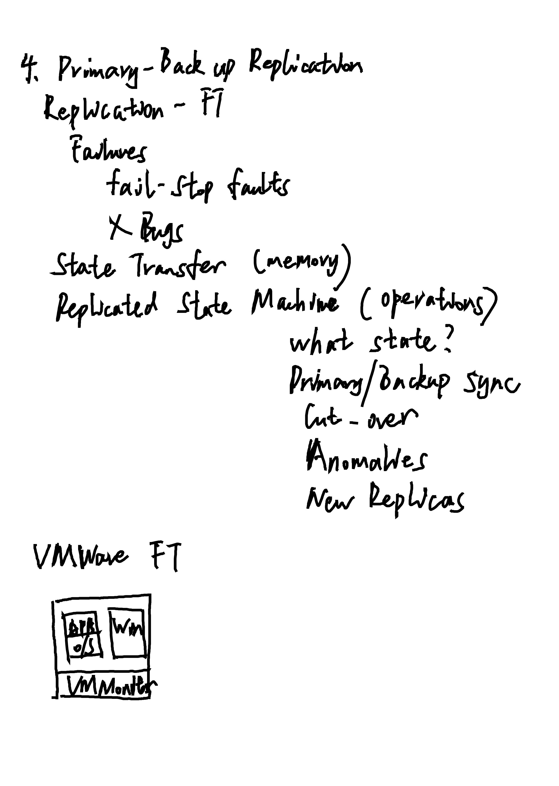
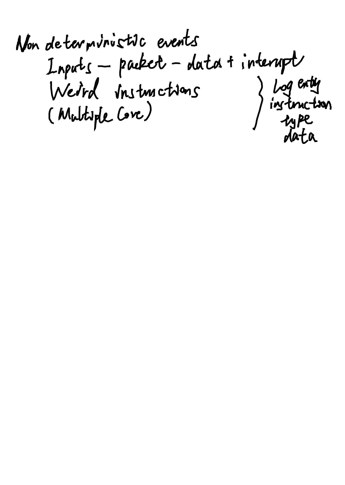

# MIT 6.824 分布式系统工程

- http://nil.csail.mit.edu/6.824/2020/schedule.html 课程表，课程表包含 youbute 视频链接，讲义和论文地址，可以自行下载
- https://www.youtube.com/watch?v=cQP8WApzIQQ&list=PLrw6a1wE39_tb2fErI4-WkMbsvGQk9_UB
- https://www.bilibili.com/video/av87684880/ 2020 年最新官方视频

# 其他资料

- https://zhuanlan.zhihu.com/p/34680235
- https://www.zhihu.com/question/29597104
- https://www.bilibili.com/video/av38073607/
- https://pdos.csail.mit.edu/6.824/index.html
- https://github.com/ty4z2008/Qix/blob/master/ds.md#
- https://github.com/chaozh/MIT-6.824
- https://www.v2ex.com/t/574537


# 1. Introduction

why?

- parallelism 并行
- fault tolerance 容错
- physical
- security / isolated

challenges:

- concurrency
- partial failure
- performance

lectures + papers + exams + labs + project(optional)

- Lab1 - MapReduce
- Lab2 - Raft for fault tolerance
- Lab3 - k/v server
- Lab4 - shared k/v service

Infrastructure - Abstractions

- Storage
- Communication
- Computation

Implementation

- RPC
- Threads
- Concurrency

Performance

- Scalability -> 2x computers -> 2x throughput

Fault Tolerance

- Availability
- Recoverability: non-volatile storage; replication

Topic - consistency

- Put(k,v)
- Get(k) -> v
- Strong / Weak

MapReduce (word count):

```
input1 -> Map a,1     b,1
input2 -> Map         b,1
input3 -> Map a,1             c,1

              reduce ------------------------a,2
                     reduce -----------------b,2
                              reduce --------c,1


Map(k, v): k[filename], v[content of this map]
  split v into words
  for w in each word:
    emit(w, "1")

Reduce(k, v):
  emit(len(v))
```

# 2. RPC and Threads

Why Go?

- simple
- type/memory safe
- GC

Threads (or event driven)

- IO concurrency
- Parallelism
- Convenience

Thread challenges:

- race (use lock) `mu.Lock(); n++; mu.UnLock()`
- coordination: channels, sync.Cond, waitGroup
- deadlock

# 3. GFS(Google File System)

paper link: https://pdos.csail.mit.edu/6.824/papers/gfs.pdf

Big Storage. Why Hard

- Performance -> Sharding
- Faults -> Tolerance
- Tolerance -> Replication
- Replication -> Inconsistency
- Consistency -> Low performance

Strong Consistency

Bad Replication Design


GFS:
Big, Fat
Global
Sharding
Automatic recovery

Single data center
Internal use
Big sequential access


# 4. Primary-Backup Replication



