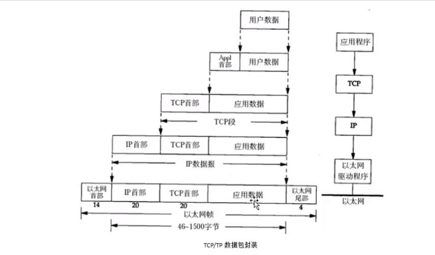

# 协议

+ `OSI`七层模型和`TCP/IP`模型

  

  + 为什么套接字编程接口提供的是从OSI模型的顶上三层进入传入层接口？  

    + 因为应用层处理具体的网络应用，对通信细节了解不多；而下面的四层对具体网络应用了解不多却处理所有的通信细节。

    + 顶上三次构成用户进程，底下四层构成却是操作系统的内核

+ 通信过程  

+ 以太网帧格式

+  `ARP`数据格式  
   
   以太网帧格式的**类型=0x06**时，就是**APR应答请求**。`ARP`是为了获取下一跳的mac地址。
+  IP段格式  
   
   IP段在以太网帧中属于46-1500字节的数据部分。
+  tcp数据封装
   

# TCP/IP

UDP是一个无连接的、简单的、不可靠数据协议，TCP是一个面向连接的、可靠的字节流协议。

### 1. TCP状态

+ TCP建立连接  
  通常服务端是被动打开，客户端调用`connect`函数实现主动打开，开启tcp三次握手：
  + client调用`connect`发起主动打开，使得客户端向服务端发送一个`SYN`分节，告诉服务器客户端将在待建立连接中要发送的数据初始序列号，比如`J`。
  + 服务器端确认(`ACK`)客户的`SYN`，同时自己也得发送一个`SYN`分节，告诉客户端将在同一连接中发送得数据初始序列号，比如`K`。
  + 客户端确认服务器端的`SYN`分解。

+ TCP断开连接  
  TCP的建立需要三个分节，终止需要四个分节。

  + 一端调用 ***`close`***，该端TCP发送一个`FIN`分节，**表示数据发送完毕**。
  + 接受到这个`FIN`分节的一端是被动关闭方。TCP接受到`FIN`分节后确认(`ACK`)。`FIN`的接受表示再也数据可以接受。
  + **一段时间后**，被动关闭方将调用 ***`close`***函数关闭它的套接字，使得TCP向主动关闭方也发送一个`FIN`分节。
  + 主动关闭方确认这个由被动关闭方发送的`FIN`分节。  
      
    这里的关闭是全关闭，即TCP的两端都关闭了。对方`read`函数在遇到`FIN`时返回0，就类似于`EOF`。

+ TCP状态图  
  TCP为连接定义了11种状态，如下图，是11种状态之间的转换。

  + 主动方三个重要状态

    + `ESTABLISHED`：三次握手已经完成

    + `FIN_WAIT_2`：**主动关闭方**，半关闭完成

    + `TIME_WAIT`：  
      这个状态存在原因：  

      + **主动关闭方**，用来等`2MLS`超时，等的原因是不确定对方是否接受到自己发的`ACK`信号，如果没有送到，那么就需要对方再发送一次`FIN`分节，这一端再重新发送一次`ACK`。
      + 允许老的重复分节在网络中流逝。

    + `TIME_WAIT`状态，对大并发服务器的影响     

      > 应该尽可能避免在服务器端出现`TIME_WAIT`状态。如果服务器主动断开连接（先于clinet调用close），服务器就会进入`TIME_WAIT`。    
      > 因此，协议设计上，应该让客户端主动断开连接，这样就把`TIME_WAIT`分散到大量的客户端。如果客户端不活跃了，一些客户端不断开连接，就会占用服务器的连接资源，服务器也要有个机制来踢掉不活跃的client。

### 2. TCP输出

如图，是写一个数据到tcp套接字中时的过程。应用进程调用`write`函数时，内核从该应用进程的缓冲区中复制所有的数据写到套接字的发送缓冲区中。`write`函数返回，只是表示上述过程数据复制完成，可以重新使用原来的应用进程的缓冲区，而不是对端tcp已经接收到数据。

# *socket*

### 1. socket地址结构

+ `sockaddr_in`  
  ipv4协议的地址结构是`sockaddr_in`，ipv6的地址结构是`sockaddr_in6`。

  
  
  + `sin_family`：表示地址簇，`ipv4: AF_INET, ipv6: AF_INET6`，
  + `sin_port`：16位的端口号
  + `sin_addr`：点分十进制。
  
+ 通用地址结构  
  结构体是`sockaddr`，方便可以接受ipv4/ipv6的地址结构。之所以采用`sockaddr`，而不采用`void*`是因此socket编程早于ANSI C。

  
  
  将`sockaddr_in/sockaddr_in6`强制转换为`sockaddr`，通过`sockaddr`的`sa_family`来分别使用的是ipv4/ipv6。
  
+ 网络字节序列和主机字节序列转换  
  &emsp;&ensp;TCP/IP协议规定，网络传输字节按照**大端字节序列**方式      
  &emsp;&ensp;大端：低地址存储在高位。小端：低地址存低位。  

    + `sin_port` 转换

      
      
    + `sin_addr` 转换  
      与协议无关的的转换函数，即ipv4/ipv6都可以。
  
      
      
      ipv4专用的转换函数
      
      

### 2. socket函数  

客户端的tcp和服务端tcp通信与socket函数关系，如图所示。  
&emsp;&emsp;&emsp;

+ `socket`

  
  
  失败时返回-1，成功是返回一个非零整数值，表示套接字描述符，sockfd。
  
  + 参数
    + *`family`*：`AF_INET,AF_INET6,AF_LOCAL`
  + *`type`*：`SOCK_STREAM`、`SOCK_DGRAM`，还可和`SOCK_NOBLOCK`和`SOCK_CLOEXEC`进行组合使用。
    + *`protocol`*：0，表示选择`family`和`type`组合系统默认值。
+ 状态：  
    创建`sockfd`以后，处于`CLOSED`状态。
  
+ `connect`

  
  
  客户端调用函数。  
  
  + 返回值：成功返回0，失败返回-1。
    客户端调用`connect`函数，**会激发`TCP`的三次握手过程**，而且仅仅在连接成功或者失败才返回。**客户端是在第二个分节返回，服务端是第三个分节返回**。  
   + *`ETIMEOUT`*：若客户端没有收到`SYN`分节响应，就会返回这个错误。
     + *`ECONNREFUSED`*：若对客户端的`SYN`分节响应的是`RST`，表示服务器主机在指定的端口上没有进程与之连接，客户端一接受到`RST`就返回`ECONNREFUSED`错误。
   + 不可达错误。
  + 参数
    + *`sockfd`*：是`socket`函数返回值。
    + *`sockaddr`*：是套接字的地址结构，`sockaddr_int/sockaddr_in6`强制转换而来。
    + *`addrlen`*：传入的地址结构大小。  
  + 状态：  
    `connect`会使得当前套接字从`closed`状态转移到`SYN_SENT`状态，如成功再转移到`ESTABLISHED`状态，若失败则该套接字不可用，**必须关闭**。
  
+ `blind`

  
  
  服务器端调用函数。  
  addr的地址一般选择通配地址`ADDR_ANY`，端口选择一个大于1024的端口。ip地址和端口哪个是0，哪个就由内核决定。
  
+ `listen`

  
  
  `listen`函数由服务器端调用。
  
  + 作用完成两件事：
    + `socket`函数创建的套接字是一个主动套接字，即是一个将会主动调用`connect`函数发起连接的客户端套接字。`listen`把一个未连接的套接字转换程一个被动套接字，告诉内核接受指向这个被动套接字的连接请求。**此时的状态是:`LISTEN`**
  + 参数`backlog`规定了内核为相应套接字排队的最大连接个数。
  + `backlog`  
  内核为每个**监听**套接字维护两个队列：  
      &emsp;&ensp;(1) 未完成连接队列：处于`SYN_RCVD`状态的客户端套接字。   
      &emsp;&ensp;(2) 已完成连接队列：每个已经完成TCP三次握手过程的客户端套接字。这些套接字处于`ESTABLISHED`状态。  
      backlog = 两个队列数之后。
      
  + 状态转移   
    如图，当来自客户的`SYN`分节到达时，TCP在未连接队列创建一个新项，然后响应以三次握手的第二个分节，这一项一直保留在未完成连接队列中，直到三次握手的第三个分节到达或者超时。如果到达，该项就从未完成连接队列中移到已完成连接队列的队尾。当调用`accept`时，已完成连接队列的队首将作为`accept`的返回值，如果已完成连接队列是空，那么调用`accept`函数的进程会进入睡眠状态。
    &emsp;&ensp;&emsp;&ensp;  
  
+ `accept`

  
  
  调用`accept`时，已完成连接队列的队首将作为`accept`的返回值，如果已完成连接队列是空，那么调用进程进入睡眠状态。成功返回客户端的已连接套接字`connfd`，失败返回-1。
  
  `accpet`函数返回时，表示已连接套接字`connfd`和服务器端的监听套接字`listenfd`完成了三次握手。
  
+ *`EMFILE`*  
    如果函数`accept`返回`EMFILE`，即文件描述符过多，怎么处理？

       >先实现准备一个空闲的文件描述符 *`/dev/null`*。遇到这种情况，先关闭这个空闲的文件描述符，就可以获得一个文件描述名额，然后再`accept`就可以拿到这个连接的`socket`文件描述符，随后立即`close`，就优雅的断开了与客户端的连接，最后重新打开空闲文件，以备这种情况再次出现。

+ `close`

  
  
  这个函数表示的把该套接字标记为已关闭，然后立即返回到调用进程，该套接字描述符不能再被调用进程使用。  
  
  + 注意事项
  + 由于描述符是引用计数，close只是减少该引用计数，只有当该引用计数为0时才会引用终止序列
    + tcp会先将已经排队等待发送到对端的任何数据发送过去，然后再发送终止序列`FIN`。因此，调用close不是立即发送终止序列。

+ `shutdown`

  
  
  + `shutdown`解决的是`close`的两个限制：
    + `close`把描述符计数减一，仅仅在计数变为0时才关闭套接字。`shutdown`可以不管描述符计数就激发TCP的正常连接终止序列。
    + `close`终止读和写两个方向的数据传递，`shutdown`是半关闭，可以只是关闭一个方向数据流。
+ 参数
  + `how`:
    + `SHUT_RD`：关闭读
    + `SHUT_WR`：关闭写
    + `SHUT_RDWR`：关闭读写

# select/poll/epoll

让内核来监听客户端。使用进程或者线程，消耗的资源比较大。

### 3. `epoll`

+ `event`

  + `EPOLLIN`
    + 内核中socket接受缓冲区为空  -->  低电平 --> 不可读
    + 内核中socket接受缓冲区不空  -->  高电平 --> 可读
  + `EPOLLOUT`
    + 内核中socket接受缓冲区为满  -->  低电平 --> 不可写
    + 内核中socket接受缓冲区不满  -->  高电平 --> 可写

+ 工作模式  

  + `LT`电平触发：高电平触发
  + `ET`边缘触发：
    + 低电平-->高电平 触发
    + 高电平-->低电平 触发

+ LT模式的工作流程
  

    + `busy loop`  
      在使用`epoll_LT`模型时，要注意一个忙等待事件(`busy-loop`)。  

      > 在 *`connfd=accept(listenfd,...)`* 获得监听套接字`connfd`之后，不能立即监听`connfd`的`EPOLLOUT`事件，因为刚获得`connfd`的接受缓冲区肯定是空的，一直处于高电平，处于可写状态。如果此时就监听那么将一直触发`epoll_wait`函数，会一直等待写满，即`busy loop`。

    + 正确的流程  
      在第一次你 *`n=write(connfd, buffer, sizeof(BUFFER))`* 之后，如果返回的字节数`n!=sizeof(buffer)`，说明socket的发送缓冲区小于应用层的buffer的缓冲区，此时需要做两件事：

      + 需要将未发完的数据添加到应用层缓冲区OuyBuffer
      + **关注`connfd`的`EPOLLOUT`事件**   

      等待`connfd`的`EPOLLOUT`事件的到来：取出应用层的缓冲区中的数据发送，*`write(connfd, ...)`* 。如果应用层缓冲区中的数据发送完毕，**取消关注`EPOLLOUT`事件**。因为不取消，sokcet发送缓冲区为空后，又会触发`EPOLLOUT`，但是此时数据已经发送完毕，又会陷入`busy loop。`

+ ET模式的工作流程    
    
  ET工作模式不存在LT中的`busy loop`，但是会有更麻烦的问题：*`read/write`* 直到返回`EAGAIN`错误。否则程序会发送意外。  

    + `read`  
      在 *`connfd=accept(listenfd,...)`* 之后得到的`connfd`是边缘触发，因此不会在一开始就触发`EPOLLIN/EPOLLOUT`。

      > 触发`EPOLLIN`事件后，如果`connfd`的接受缓冲区中的数据没有读取完毕，那么当`connfd`的又接受到新的缓冲区数据时，`EPOLLIN`事件不会触发。因为之前的数据没有读取完，处于高电平状态，此时又来新的数据并没有改变电平状态，因此即使有新的数据到来也无法触发`EPOLLIN`。同理`write`。

      重点： ***`read/write`*** 必须将缓冲区读完或者写满。

    + `EMFILE`  
      如果在使用 *`connfd=accept(listenfd,...)`* 返回失败，并且返回的错误是 `EMFILE`，那么会使得`listenfd`的接受缓冲区有数据为高电平。如果不清除，那么即使后面有空余的文件描述符也无法使用，因为`listenfd`的接受缓冲区一直处于有数据的高电平状态，无法触发`EPOLLIN`。

### 4. I/O复用模型对比

  
  
  
    

