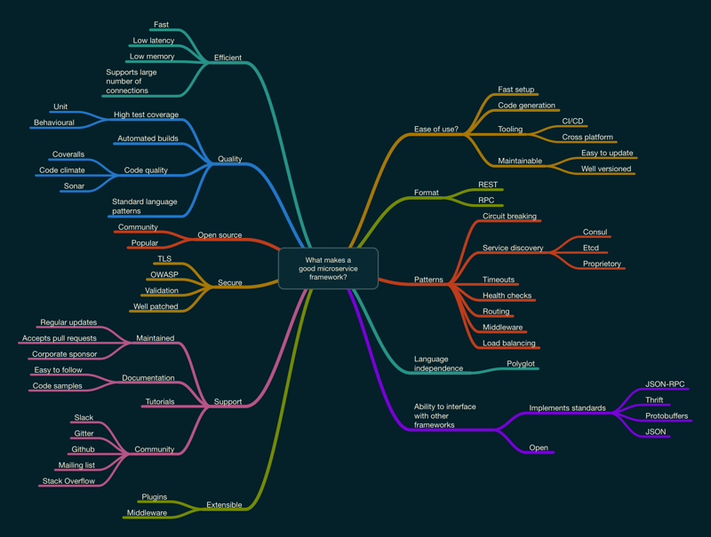
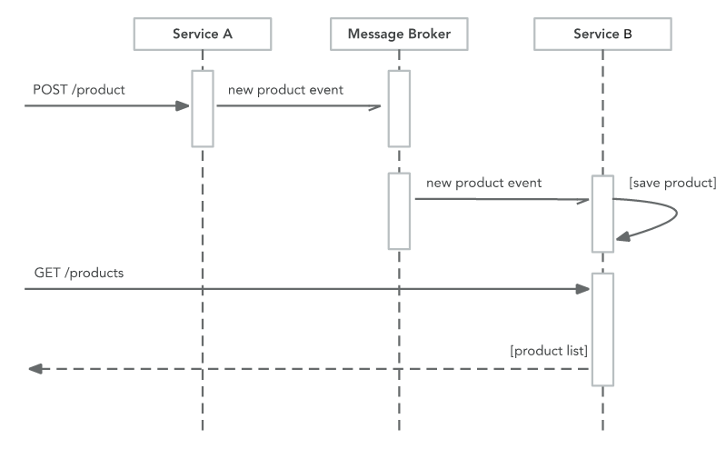
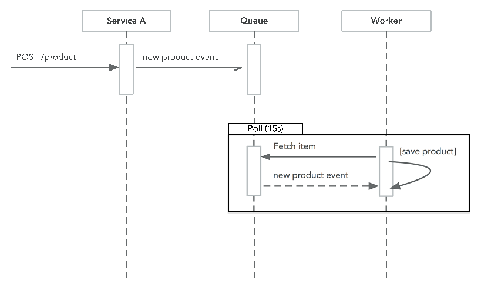
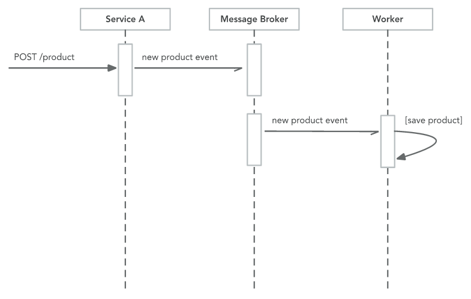

code: https://github.com/building-microservices-with-go/

# 3. Docker

 Containers are immutable instances of images, and the data volumes are by default non-persistent.

# 4. Testing

use httptest

```
func TestSearchHandler( t *testing.T) {
	handler := SearchHandler{}
	request := httptest.NewRequest("GET", "/search", nil)
	response := httptest.NewRecorder()

	handler.ServeHTP(response, request)
	if response.Code != http.StatusBadRequest{
		t.Errorf("Expected BadRequest got %v", response.Code)
	}
}
// httptest generate Mock versions of the dependent objects http.Request and http.ResponseWriter
```

### Dependency injection and mocking

github.com/stretchr/testify

### Code coverage

```
go test -cover ./...
```

### Behavioral Driven Developent(BDD)

github.com/DATA-DOG/godog/cmd/godog

### Testing with Docker Compose


### Benchmarking and profiling

search_bench_test.go
go test -bench=. -benchmem


Go supports three different types of profiling:

- CPU, Identifies the tasks which require the most CPU time
- Heap: Identifies the statements responsible for allocating the most memory
- Blocking: Identifies the operations responsible for blocking Goroutines for the longest time

Add it to the beginning of your main Go file and, if you are not already running an HTTP web server,
start one:

```
import (
	"log"
	_ "net/http/pprof"
)

go func() {
	log.Println(http.ListenAndServe("localhost:6060", nil))
}
```

# 5. Commong Patterns

### Design for failure
Anything that can go wrong will go wrong.
想象一个场景，你使用了同步方式调用第三方邮件发送API，某一天用户量因为打了广告大涨，结果却因为调用
邮件API的频率限制导致应用一直失败。

### Patterns
##### Event Processing
The first question we should ask ourselves is "Does this call need to be synchronous?"

Event processing with at least once delivery.

##### Hanlding Errors
Append the error every time we fail to process a message as it gives us the history of what went wrong.

##### Dead Letter Queue
we can examine the failed messages on this queue to assist us with debugging the system

##### Idempotent transactions and message order

##### Atomic transactions

try to avoid distributed transactons. Use message queue, when somethiing fails, keep retrying

##### Timeouts
The key feature of a timeout is to fail fast and to notify the caller of this failure.

```
// github.com/eapache/go-resiliency/tree/master/deadline
func makeTimeoutRequest() {
	dl := deadline.New(1 * time.Second)
	err := dl.Run(func(stopper <-chan struct{}) error {
		slowFunction()
		return nil
	})
	switch err {
	case deadline.ErrTimeOut:
		fmt.Println("Timeout")
	default:
		fmt.Println(err)
	}
}
```

##### Back off

A backoff algorithm waits for a set period before retrying after the first failure, this then increments
with subsequent failures up to a maximum duration.

go-resiliency package and the retryier package

##### Circuit breaking
Circuit breaking is all about failing fast, automatically degrade functionality when the system is under stress.

how it works:
Under normal operations, like a circuit breaker in your electricity switch box, the breaker is closed and traffic
flows normally. However, once the pre-determined error threshold has been exceeded, the breaker enters the open state,
and all requests immediately fail without even being attempted. After a period, a further request would be allowed
and the circuit enters a half-open state, in this state a failure immediately returns to the open state regardless
of the errorThreshold. Once some requests have been processed without any error, then the circuit again returns
to the closed state, and only if the number of failures exceeded the error threshold would the circuit open again.


```go
// go-resilience

// Threshold: number of times a request can fail before the circuit opens
// successThreshold: number of times that we need a successful reqeust in the half-open state before we move back to open
// timeout: the time that circuit will stay in the open state before chaning to half-open
func New (error Threshold, successThreshold int, timeout time.Duration) *Breaker
package main

import (
	"fmt"
	"time"
)

func main() {
	b := breaker.New(3, 1, 5*time.Second)
	for {
		result := b.Run(func() error {
			// call some service
			time.Sleep(2 * time.Second)
			return fmt.Errorf("Timeout")
		})

		switch result {
		case nil:
			// success
		case breaker.ErrBreadkerOpen:
			// our function wasn't run because the breaker was open
			fmt.Println("Breaker open")
		default:
			fmt.Println(result)
		}
		time.Sleep(500 * time.Millisecond)
	}

}
```

One of more modern implementations of circuit breaking and timeouts is the Hystrix library from Netflix.

- github.com/Netflix/Hystrix
- github.com/afex/hystrix-go

##### Health checks

Every services should expose a health check endpoint which can be accessed by the consul or another server monitor.
Recommend you look at implementing these features:

- Data store connections status(general connection state, connection pool status)
- current response time (rolling average)
- burrent connections
- bad requests(running average)

##### Throttling (限流)
Throttling is a pattern where you restrict the number of connections that a service can handle,
returning an HTTP error code when this threshold has been exceeded.

### Service discovery
> Microservices are easy, building microservice is hard

The solution is service discovery and the use of a dynamic sevice registery, like Consul or Etcd.
There two main patterns for service discovery:

##### server-side service discovery
typically, there will be a resverse proxy which acts as a gateway to your services, it contains the dynamic
service registry and forwards your request on to the backend services.
The reverse proxy my become a bottleneck.

##### client-side service discovery

Prefer client-side, this gives you greater control over what happens when a failure occurs.
Client is responsible for the service discovery and load balancing.

##### Load balancing
Implement in Go

`func NewLoadBalancer(strategy Strategy, endpoints []url.URL) * loadBalancer`

### Caching
you should be talking about consistency and the tradeoffs with performance and cost.


# 6. Microservices Frameworks

### What makes a good microservice Frameworkds


### Micro

github.com/micro/go-micro

- Tooling (CI/CD, cross platform):  protoc
- Maintainable: verion
- Format(REST/RPC): use googles Protocol Buffers
- Patterns: most have been implemented in Micro and many more are avaiable as plugins.
- Language independence: proto buffer support
- Ability to interface with other frameworks:
- Efficiency:
- Quality: very high with automated builds

### Kite

go get github.com/koding/kite

### gRPC

```
$ go get google.golang.org/grpc
$ go get -u github.com/golang/protobuf/{proto,protoc-gen-go}
```

# 7. Logging and Montoring

stack traces and other application outout which helps you diagnose a problem can be broken down into three categories:

- Metrics: such as time series data(for example, transaction or individual component timings)
- Text-based logs: such as Nginx or text log from your application software
- Exceptions

### Metrics

time-series database using a unique key as an identifier

Types of data best represented by metrics: it is the data that is meaningful when expressed by simple numbers,
such as request timings and counts.

##### Name convertions (命名惯例)
良好一致性的设计允许我们使用通配符过滤。statsd

##### Saas(software as a service): Datadog

##### Self-hosted:

There are many options for backend data stores such as Graphite, Prometheus, InfluxDB, ElasticSearch.
However, when it comes to graphing, Grafana leads the way.

##### Graafana

Display metrics

### Logging

##### Distributed tracing with correlation IDs
zipkin is a distributed tracing system designed to trouble shoot latency.

##### ELK (Elasticsearch, Logstash, and Kibana)

- Elasticsearch: databastore for logging data
- Logstash: is used for reading the data from your application logs and storing it in ElasticSearch
- Kibana: use for query data

### Exceptions
Go has two great methods for handling unexpected errors:

##### panic

`func panic(v interface{})`, built-in panic stops normal execution of the current goroutine,
All the defered functions are run in the normal way then the program is terminated.

##### recover

The recover function allows to manage the behavior of a panicking goroutine.
When called inside a deferred function, recover stops the execution of the panic and returns the error passed to the
call of panic.

`func recover() interface{}`

```go
func (p *panicHandler) ServeHTTP(rw http.ResponseWriter, r *http.Request) {
	defer func() {
		if err := recover(); err != nil {
			p.logger.WithFields(
				logrus.Fields{
					"handler": "panic",
					"status":  http.StatusInternalServerError,
					"method":  r.Method,
					"path":    r.URL.Path,
					"query":   r.URL.RawQuery,
				},
			).Error(fmt.Sprintf("Error: %v\n%s", err, debug.Stack()))
			// runtime/debug returns a formatted stack trace of the goroutine that calls it
			rw.WriteHeader(http.StatusInternalServerError)
		}
	}()

	p.next.ServeHTTP(rw, r)
}
```


# 8. Security

### Encryption and signing

##### Symmetric-key encryption
one key is used for both the encryption and desryption.

##### Public-key cryptography (asynmmetric encryption)
both sides requiring to know the secret.

The public key is used for encrypting information while the private can only be used for decrypting.

##### Digital signatures
A digital signature works by encrypting a message with a private key and then transferring the signed message.

##### X.509 digital certificates
man-in-the-middle-attack

A digital certificate contains three things:

- A public key
- Certificate information such as the owner's name of ID
- One or more digital signatures

##### TLS/SSL

TLS works using symmetrical encryption, where the client and the server both have a key which is used for encryption and decryption. If you remember the previous section, we introduced symmetrical encryption and the problems of distributing keys. TLS gets around this problem by using asymmetrical encryption in the first part of the handshake. The client retrieves the certificate containing the public key from the server and generates a random number; it uses the public key to encrypt this random number and sends it back to the server. Now that both parties have the random number, they use this to generate symmetrical keys which are used for encrypting and decrypting the data over the transport.

### External security

- Layer 2 or 3 firewalls
- Web application firewall(WAF), Cloudflare supports OWASP CRS
- API Gateway
	- Request validation
	- Authorization
	- Rate limiting
	- Logging
	- Caching
	- Request and response transformations
- DDoS protection
	- UDP fragment: creating datagrams which contain fake packets, when server attempts to reassemble packets, it is unable to do so and the resources are quickly overwhelmed
	- UDP flood: sending a flood of UDP packets with a spoofed source address to an IP address
	- DNS: A DNS attack utilizes a UDP flood to take out a DNS server.
	- NTP: is another amplification attach which takes advantage of a feature built into NTP servers
	- Chargen: character generation protocol
	- SYN flood: a classic DDoS attack that sends a lot of packets to a machine
	- SSDP: simple services discovery protocol
	- ACK: firewall; network scrubbing filters


### Application sercurity

- Prevention
	- secure communication
	- authorization
	- authentication

- Detection: applications logs

- Response

- Recovery: well backed up and aotomated

- input validation: github.com/go-playground/validator

```
package validation

import (
	"encoding/json"
	"net/http"

	validator "gopkg.in/go-playground/validator.v9"
)

// Request defines the input structure received by a http handler
type Request struct {
	Name  string `json:"name"`
	Email string `json:"email" validate:"email"`
	URL   string `json:"url" validate:"url"`
}

var validate = validator.New()

func Handler(rw http.ResponseWriter, r *http.Request) {
	request := Request{}

	err := json.NewEncoder(rw).Encode(&request)
	if err != nil {
		http.Error(rw, "Invalid request object", http.StatusBadRequest)
		return
	}

	err = validate.Struct(request)
	if err != nil {
		http.Error(rw, err.Error(), http.StatusBadRequest)
		return
	}

	rw.WriteHeader(http.StatusOK)
}
```

- Fuzzing : github.com/dvyukov/go-fuzz/go-fuzz  generating random input

- TLS:

- Securing data at rest : encrypt data in the database

- Physical machine access

- OWASP: REST Security Cheat Sheet (https://www.owasp.org/index.php/REST\_Security\_Cheat\_Sheet).
	- Never storing session tokens in a URL, use cookie or a post value (url can query in log)
	- XSS and CSRF.
	- Insecure direct object references. Checking authenticated users can modify the object in the request

- Password Hashing, hash is one-way cryptography
	- Adding a salt and a pepper. （加盐是一种常见的方式，防止被彩虹表暴力破解）
	- bcrypt: golang.org/x/crypto/bcrypt

### Maintenance

- Patching containers: run a regular build and deploy even if the application code does not change
- Software upadtes:
- Patching application code
- Logging
	- Who is preforming the action
	- what has failed or succeed
	- when is the action occurring
	- why this has failed or succeeded
	- how you can deal with the issue


# 9. Event-Driven Architecture

### Differences between synchronous and asynchronous processing

- synchronous: easier to understand, write, debug
- asynchronous: decoupling, scale, bath processing, time-based processing



### Types of asynchronous messages

- Pull/queue messaging


May have a worker process running, read from the queue retrieving the messages one by one, perform the required work,
then delete the message from the queue.
Often there is also a queue commonly called a "dead letter queue" should the worker process fail for any reason then
the message would be added to the dead letter queue.



- Push messaging



NATS.io

github.com/nats-io/go-nats

### Domain-Driven Design

Anatomy of DDD:

- Straegic design
- Tactical design
- Ubiquitous language
- Bounded Contexts
- Context Mapping

### Sofware

- Kafka : is a distributed streaming platform allows you to publish and subscribe to streams of records
- NATS.io: open source messaging system written in Go. Can perform at-most-once and at-least-once delivery
- AWS SNS/SQS
- Google Cloud Pub/Sub


# 10. Continuous Delivery

### What is Continuous Delivery?

Aspects of continuous delivery

- Reproducibility and easy setup
- Artifact storage
- Automation of tests
- Automation of integration tests
- Infrastructure as code
- Security scanning
- Static code analysis
- Smoke testing
- End 2 end testing
- Monitoring - track deployments in metrics


What does Go bring as a language which helps us with this? Now, let's look at the process:

- Build
- Test
- Package
- Integration test
- Benchmark test
- Security test
- Provision production
- Smoke test
- Monitor

### What is container orchestration ?

- Managed, such as PasS solutions like AWS ECS
- Unmanaged, like Kubenetes

### What is immutable infrastructure?

### Terraform

https://terraform.io, which enables the provisioning of infrastructure for several applications and cloud providers.

### Continuous delivery workflow

- Compile application
- Unit test
- Benchmark
- Static code analysis: megacheck, safesql
- Integration test
- Build Docker image
- Deploy application
- Smoke test
- Monitoring/Alerting
