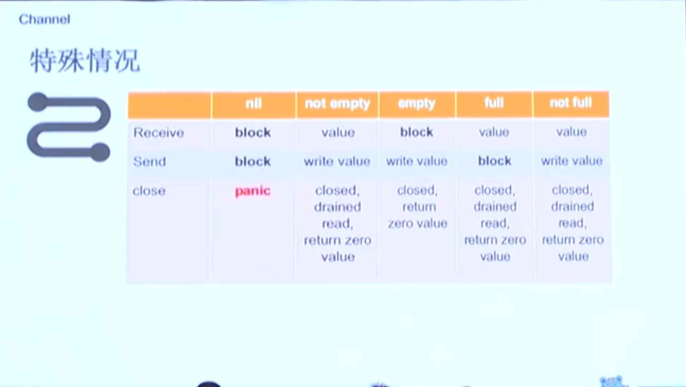
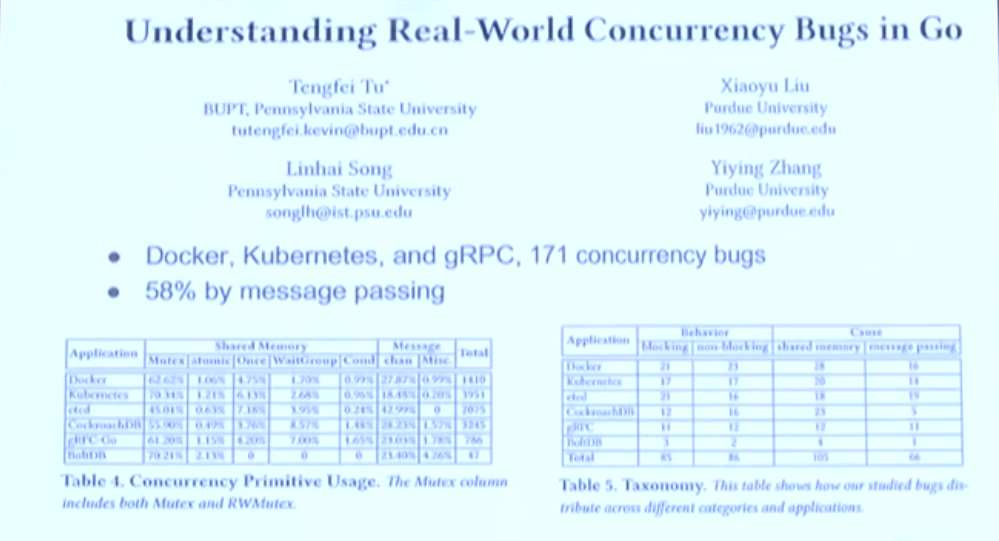
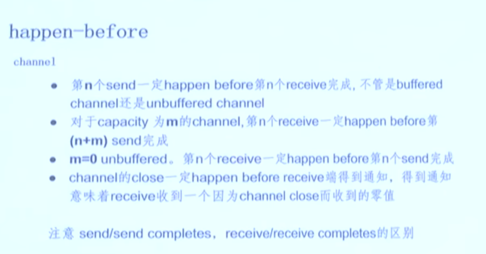
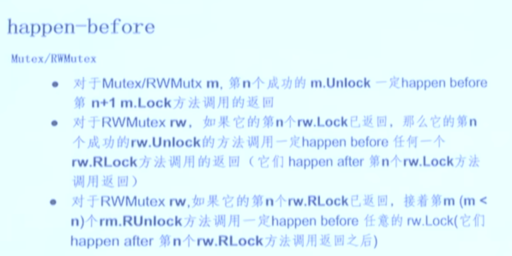
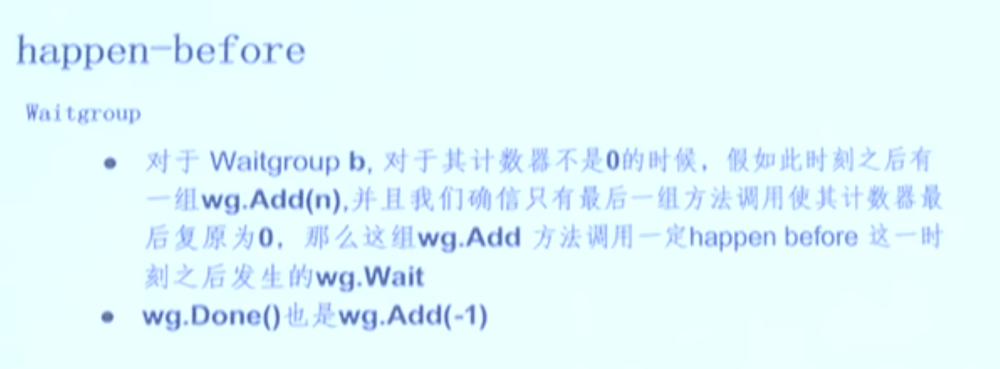

 https://www.youtube.com/watch?v=1BC3s-_v8sA


# 基本同步原语

### Mutex

- 互斥锁 Mutual exclusion
- 任何时间只允许一个 goroutine 在临界区运行
- 避免死锁
- 公平

- 零值是未锁状态
- Unlock  未加锁的 Mutex 会 panic
- 加锁的 Mutex 不和这个特定的 goroutine 关联
- 非重入锁

### RWMutex

- 可以被一堆的reader持有，或者被一个 writer 持有
- 适合大并发 read 的场景
- 零值是未加锁状态
- writer 的 Lock相对后续 reader 的 RLock 优先级高
- 禁止递归读锁(防止死锁)

### Cond (不常用)

- Mutex有些不适用
- Monitor vs Mutex. Monitor = Mutex + Condition Variables
- Condition variable 是一组等待同意一个条件的goroutine的容器

- 每个 cond 和一个Locker 相关联
- 改变条件或者调用 Wait 需要获取锁

### WaitGroup

- 等待一组goroutine完成(java CountdownLatch/CyclicBarrier)
- Add 参数可以是负数，如果计数器小于0，panic
- 当计数器为0的时候，阻塞在 Wait 方法的 goroutine 都会被释放
- 可重用, but...
- 注意不要把Add方法放到 goroutine 里和wait 一起执行

### Once

- 只执行一次初始化 func (o *Once) Do(f func())
- 避免死锁
- 即使 f panic, Once 也认为它完成了

单例
- 常量
- package 变量(eager)
- init 函数 (eager)
- GetInstance()(lazy)
- 通过 sync.Once 或者类似实现

### Pool

- 临时对象池
- 可能在任何时候任意对象都可能被移除
- 可以安全并发访问
- 装箱/拆箱

### Sync.Map

- 适用于两个 case(空间换时间)：
  - 设置一次，多次读(cache)
  - 多个 goroutine 并发的读，写，更新不同的 key
- 装箱/拆箱
- Range 进行遍历，可能会加锁
- 没有 Len 方法，并且也不会添加


# 扩展同步原语

### ReentrantLock

```go
type RecursiveMutext struct {
	sync.Mutex
	owner     int64
	recursion int32
}
```

### Semaphore

- Dijkstra 提出并发访问通用资源的并发原语 (sync/semaphore)
- 初始化一个非负的值 S
- P(wait)减1，如果 S 小于0 ，阻塞本 goroutine 进入临界区
- V(signal)加1， 如果 S 不为负值， 其他goroutine可以进入临界区

- 二进制信号量可以实现锁(0,1)
- 计数信号量

实现： sync/semaphore  sync/singleflight

### ErrGroup

- Wait会等待所有 goroutine 执行完才释放
- 如果想遇到第一个 err 就返回，用 Context


### SpinLock (自旋锁)

- 有时候很高效
- 公平性
- 处理器忙等待

### fslock 文件锁

- github.com/juju/fslock

### concurrent-map

- github.com/orcaman/concurrent-map


# 原子操作

### atomic 数据类型

- int32, int64, uint32, uint64, uintptr, unsafe.Pointer

- AddXXX(整数类型)
- CompareAndSwapXXX: cas
- LoadXXX: 读取
- StoreXXX: 存储
- SwapXXX: 交换

### 有Add没有 Subtract？

- 有符号类型，可以用 Add 负数
- 无符号类型，可以用 AddUint32(&x, ^uint32(c-1)),   AddUint64(&x, ^uint64(c-1))
- 无符号类型减一，AddUint32(&x, ^uint32(0)), AddUint64(&x, ^uint64(0))

### atomic.value
复杂类型进行原子存储和加载

- Load
- Store


# Channel

- 信号(shutdown/close/finish)
- 数据交流(queue/stream)
- 锁(mutex)



### Channel vs Mutex

过度使用channel 和goroutine

- Channel
  - 传递数据的owner
  - 分发任务单元
  - 交流异步结果
  - 任务编排

- Mutex
  - cache
  - 状态
  - 临界区



### OrDone


# 内存模型

描述线程(goroutine)通过内存交互，以及对数据的共享使用。

Go内存模型：

happend before

- goroutine的创建 happens before 所有此 goroutine 中的操作
- goroutine的销毁 happens after 所有此 goroutine 中的操作




